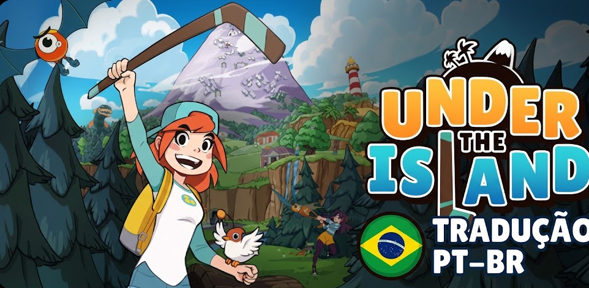
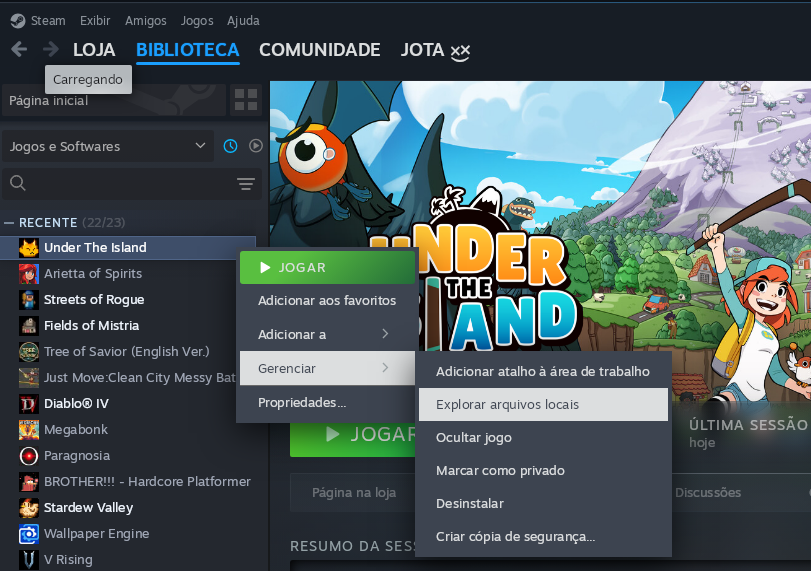
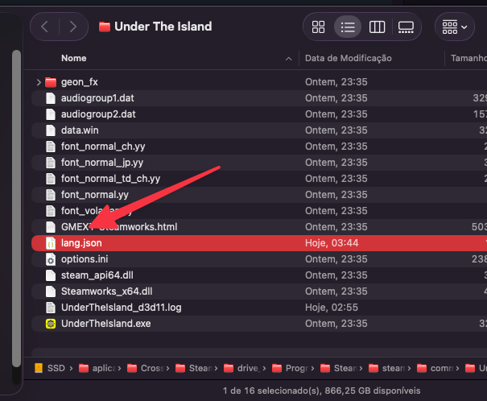
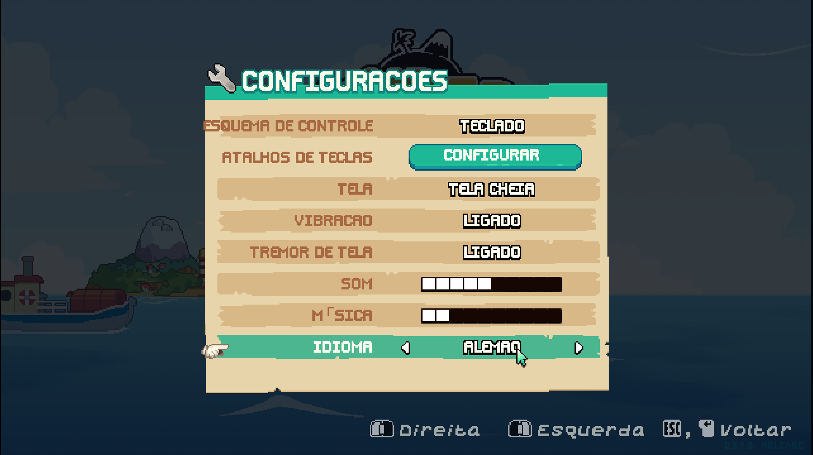
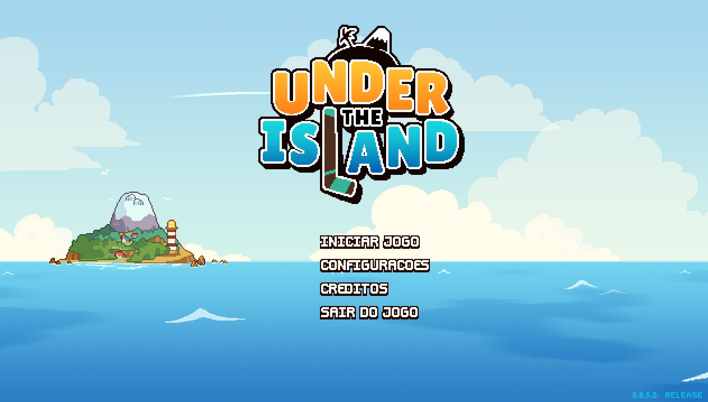

# Tradução Português Brasileiro (PT-BR) - Under the Island (Não Oficial)

<div align="center">

</div>

<div align="center">

</div>

Este repositório contém o arquivo de tradução para português brasileiro (PT-BR). O projeto foi baseado na versão alemã para garantir a integridade do arquivo JSON e evitar erros de sintaxe.

## Limitação Técnica

Limitação Técnica: O jogo não aceita UTF-8 nativamente em todos os campos, então alguns textos estarão sem acentuação ou cedilha (ç) para evitar bugs visuais.

### 🛠️ Instalação

<div align="center">

</div>

Siga os passos abaixo para aplicar a tradução no seu jogo.

### 1. Localize a pasta do jogo

Navegue até o diretório onde o jogo está instalado.

<div align="center">

</div>

### 2. Encontre o arquivo de idiomas

Dentro da pasta do jogo, localize o arquivo original chamado `lang.json`.

<div align="center">

</div>

### 3. Faça o backup do arquivo original

Antes de qualquer alteração, é essencial criar uma cópia de segurança:

```bash
cp lang.json lang.json.bak

```

_Ou apenas renomeie o arquivo `lang.json` para `lang.json.bak` usando o Finder ou Explorador de arquivos._

### 4. Substitua pelo novo arquivo

Mova o arquivo `lang.json` que você baixou para dentro da pasta do jogo, substituindo o existente.

**Via Terminal:**

```bash
mv ~/Downloads/lang.json ./lang.json

```

### 5. Inicie o jogo

Agora, ao iniciar o jogo, ele deve carregar a nova tradução em português brasileiro, basta selecionar o idiona Deutch (Alemão) nas opções de idioma, pois o jogo não tem suporte para PT-BR, mas a tradução foi feita com base na versão alemã para garantir a integridade do arquivo JSON.

<div align="center">

</div>

> [!WARNING]
> **Limitação Técnica:** Já foi dito no inicio do post, mas novamente,O jogo não aceita UTF-8 nativamente em todos os campos, então alguns textos estarão sem acentuação ou cedilha (ç) para evitar bugs visuais.

---

> [!IMPORTANT]
> **Aviso de Versão:** Esta tradução foi feita com base na versão **0.9.5.0** do jogo. Caso o jogo atualize, verifique este repositório para obter a versão mais recente e garantir a compatibilidade.

Se você seguiu todos os passos corretamente, o jogo agora deve estar em português brasileiro!

<div align="center">

</div>

Aproveite bastante o jogo, lembrando que você pode comprar o jogo para apoiar o desenvolvimento e garantir futuras atualizações da tradução! - >

Link Steam: [Under the Island - Steam](https://store.steampowered.com/app/1583520/Under_The_Island/)

<div align="center">

</div>

### 🤝 Contribuições

Curtiu o projeto? Deixe uma **Star ⭐** no repositório!

Se você encontrar algum erro de digitação, termos fora de contexto ou quiser melhorar alguma linha específica, fique à vontade para abrir uma **Issue** ou enviar um **Pull Request**.

---

Feito com ❤️ por @jotacode | Confira outros projetos em: [jotacode.dev](https://jotacode.dev) |
